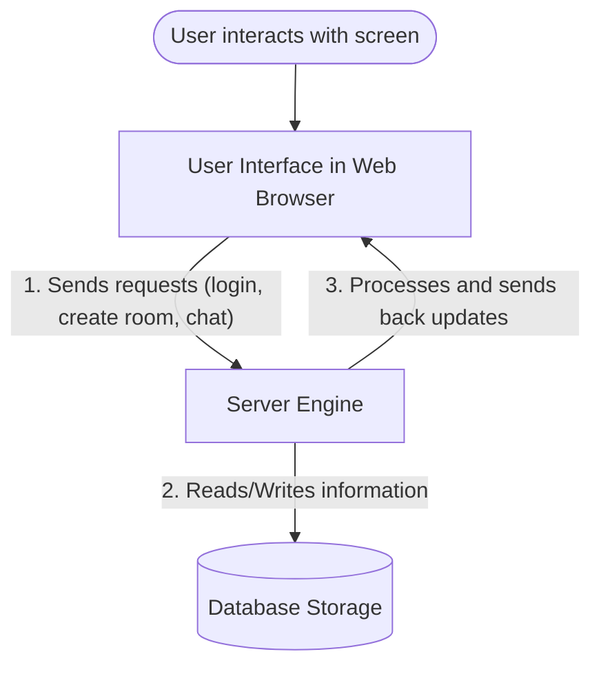
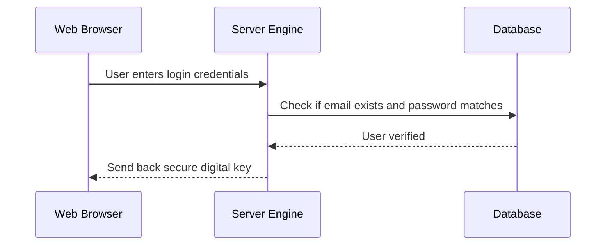
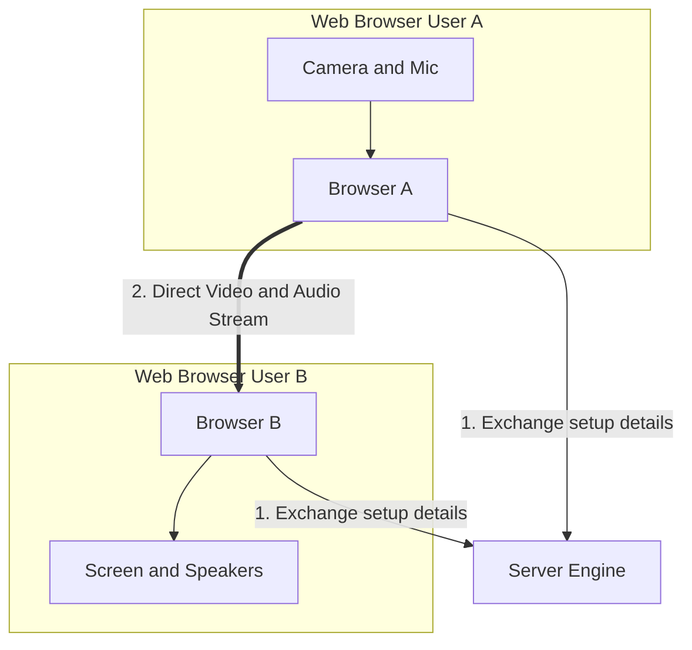
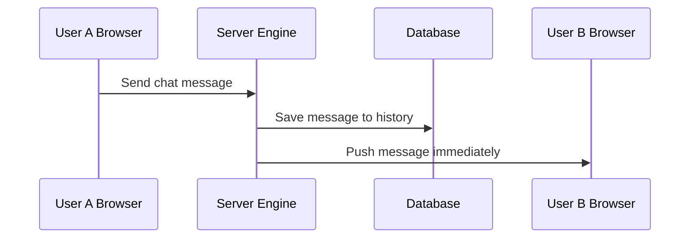
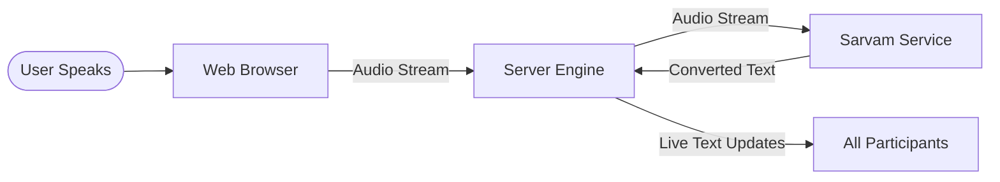
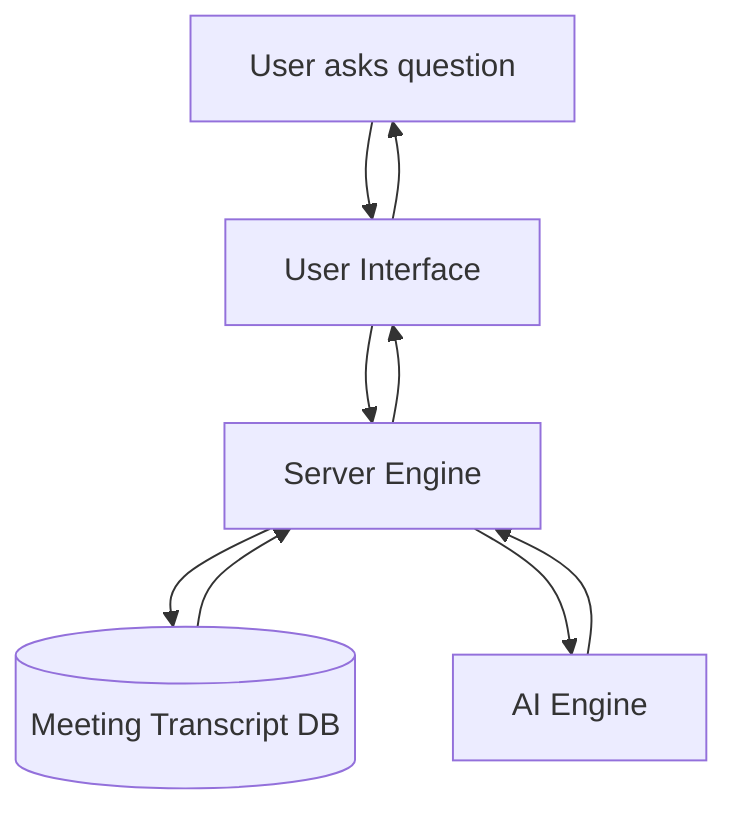

# How VideoMeet Works

This document explains how the VideoMeet application works in simple terms for non-technical users, using diagrams to show how information flows.

## What is VideoMeet?

VideoMeet is a full-featured video calling and meeting application. It allows people to join virtual meeting rooms to talk over video and audio, send text messages in real-time, view live written transcripts of their spoken words, and interact with an artificial intelligence assistant.

## The Two Main Components

The application is split into two major parts that work together:

1. **The User Interface (Frontend)**
   This is the visual part of the application that you see and click on in your web browser. It includes the buttons, forms, video windows, chat panels, and menus. It is built using modern web tools to ensure it loads quickly and is easy to use.

2. **The Server (Backend)**
   This is the behind-the-scenes engine that runs on a computer or server. It handles the heavy lifting, such as verifying user passwords when logging in, managing meeting room assignments, processing data, and talking to database systems and external services.

Here is a simple flow diagram of how the User Interface and Server talk to each other:

---

## Detailed Feature Flows

Here is an explanation of the technologies and processes that make the key features work, along with diagrams showing the data path.

### 1. Account Access and Security (Authentication)
When you log in or register, the application ensures your information is verified and secure.

* **Registration:** You input your name, email, and password. The User Interface sends this to the Server, which securely scrambles the password and stores it in the Database.
* **Logging In:** The Server checks your credentials. If correct, it generates a secure digital key (token) and sends it to your browser. Your browser saves this key and sends it with every future request to prove who you are.

### 2. Video and Audio Connections (WebRTC)
When you start a video call, your camera and microphone capture your video and audio. 

* **The Connection Process:**
  1. Your browser contacts the Server to find other people in the meeting.
  2. The Server helps exchange connection setup details between you and the other participants.
  3. Once the setup details are shared, the Server steps aside.
  4. Your browser connects directly to the browsers of the other participants. This direct, browser-to-browser connection allows for high-quality video and audio with minimal delay.

### 3. Instant Chat and Messages (Socket.io)
When you send a chat message or join a subgroup, you want the action to happen instantly without having to refresh the webpage. 

* **The Persistent Connection:** The application keeps a continuous, open communication line between your browser and the Server.
* **The Message Flow:** As soon as you type a message and press send, it is instantly pushed through this line to the Server. The Server saves the message in the Database and immediately pushes it to the communication lines of everyone else in the meeting.

### 4. Live Transcripts (Voice-to-Text)
VideoMeet can automatically convert what you say during a meeting into written text in real-time.

* **Primary Service (Sarvam STT):** When you speak, your browser streams the audio to the Server. The Server forwards the audio stream to an external service named Sarvam. This service processes the audio, turns it into text, and sends it back to the Server, which shares it with everyone in the meeting.
* **Fallback Option:** If the primary service is not available or has no key, the application uses the speech recognition feature built directly into your web browser to generate the text.

### 5. AI Assistant
The application includes an artificial intelligence assistant to help you during meetings.

* **Asking Questions:** You can ask the assistant questions during a meeting (such as requesting a summary).
* **Generating Answers:** The Server reads the live meeting transcript and database information, sends it to the AI engine, and returns a clear answer to your screen.

### 6. Database Storage (PostgreSQL)
To ensure your account details, meeting history, and past transcripts are not lost when you close your browser or turn off your computer, the Server saves this information in a permanent database. When you log back in, the Server retrieves your information from this database.
